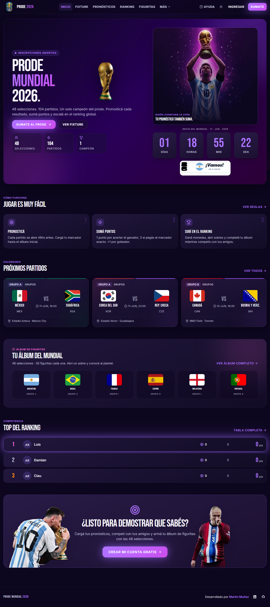
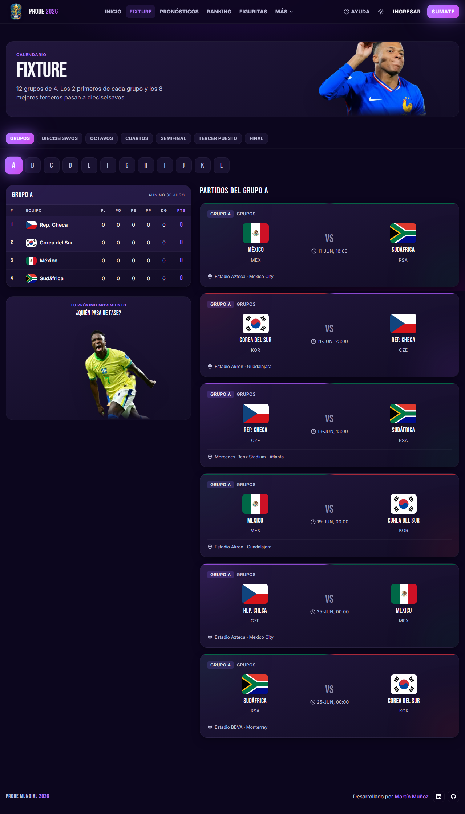
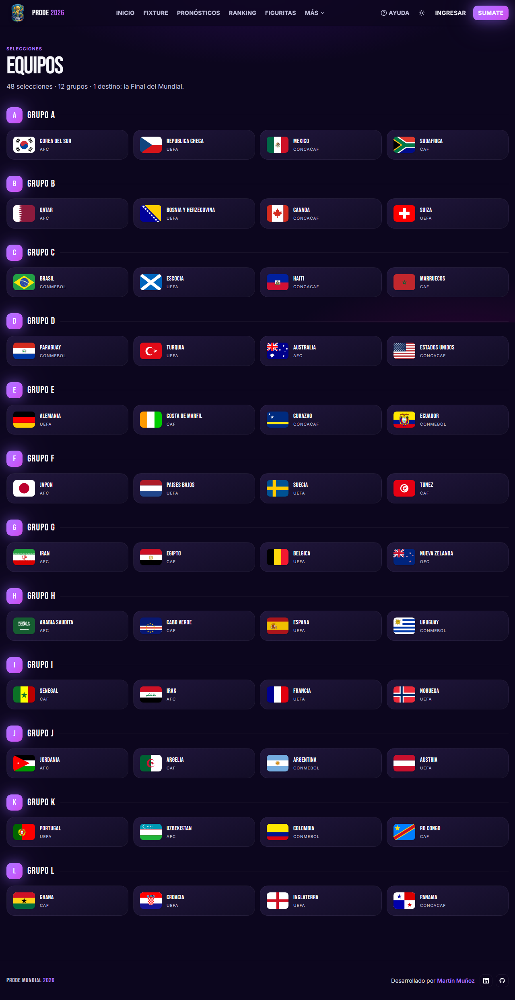

# ⚽ Prode Mundial 2026

Aplicación web de **prode (quiniela de pronósticos) para el Mundial 2026**. Pronosticá los 104 partidos, sumá puntos, competí en un ranking en vivo y armá un álbum de figuritas con economía de monedas. Pensada para grupos de amigos o familia, lista para autohostear.

> Template open source. Cloná, conectá tu propio Supabase y deployá a Cloudflare Workers en tu cuenta. **No incluye datos de usuarios reales** — solo el código y el fixture/planteles del Mundial.

---

## ✨ Funcionalidades

- **Pronósticos por partido** con ventana de carga (se cierra al inicio del partido).
- **Scoring**: 1 punto por acertar el resultado, 3 por el marcador exacto, +1 por goleador, todo multiplicado por la fase (octavos x1.5, cuartos x2, semis x2.5, final x3).
- **Bola de cristal**: predicciones de torneo (campeón, goleador, mejor jugador, arquero, fair play) que se bloquean al arrancar el Mundial.
- **Ranking en vivo** con recálculo automático al cargar resultados.
- **Figuritas**: ganás monedas con tus aciertos, abrís sobres (con rarezas y probabilidades), completás el álbum, reciclás repetidas e intercambiás con otros.
- **Desafíos 1v1** por jornada.
- **Panel admin**: cargar resultados, sincronizar planteles/resultados desde API-Football, editar nombres de usuario, cargar premios, y un **predictor Elo + Poisson** que da marcadores y probabilidades V/E/D y se autoajusta con los resultados reales.
- **Tema claro/oscuro**, diseño responsive, cards holográficas.

---

## 🧱 Stack

- **Frontend/SSR**: [TanStack Start](https://tanstack.com/start) (React) + Vite + Tailwind CSS v4
- **Backend**: [Supabase](https://supabase.com) — Postgres, Auth, Storage, Row Level Security, funciones/triggers
- **Deploy**: [Cloudflare Workers](https://workers.cloudflare.com) (free tier, 24/7, sin servidor propio)
- **Datos de fútbol** (opcional): [API-Football](https://www.api-football.com)

La lógica sensible (scoring, economía de monedas, pagos) vive en **funciones Postgres `SECURITY DEFINER`** protegidas, y los datos por **RLS**. El frontend nunca toca el cálculo de puntos ni el balance de monedas directamente.

---

## 🚀 Puesta en marcha

### Requisitos
- Node.js 20+
- Una cuenta de [Supabase](https://supabase.com) (free tier alcanza)
- [Supabase CLI](https://supabase.com/docs/guides/cli) (para aplicar las migraciones)
- Una cuenta de [Cloudflare](https://dash.cloudflare.com) (para deployar)

### 1. Clonar e instalar
```bash
git clone https://github.com/<tu-usuario>/<tu-repo>.git
cd <tu-repo>
npm install
```

### 2. Crear el proyecto Supabase y aplicar el esquema
Creá un proyecto nuevo en Supabase y aplicá las migraciones (crean tablas, enums, RLS, funciones, triggers y siembran el fixture + planteles del Mundial):
```bash
supabase link --project-ref <TU_PROJECT_REF>
supabase db push
```
> Alternativa sin CLI: pegá los archivos de `supabase/migrations/` en orden en el SQL Editor del dashboard.

### 3. Variables de entorno
Copiá la plantilla y completá con **tus** valores (Supabase Dashboard → Settings → API):
```bash
cp .env.example .env
```
Las publishable/anon keys son públicas por diseño; la `SUPABASE_SERVICE_ROLE_KEY` es secreta y solo se usa del lado del servidor.

### 4. Correr en local
```bash
npm run dev      # http://localhost:8080
```

---

## ☁️ Deploy a Cloudflare Workers

1. Editá `wrangler.jsonc`: poné tu `name` de worker y tus `vars` (`SUPABASE_URL`, `SUPABASE_PUBLISHABLE_KEY`).
2. Cargá los secretos (no van en el repo):
   ```bash
   npx wrangler secret put SUPABASE_SERVICE_ROLE_KEY
   npx wrangler secret put API_FOOTBALL_KEY        # opcional
   ```
3. Deploy:
   ```bash
   npm run deploy
   ```
4. En Supabase → Authentication → URL Configuration, agregá tu URL pública del worker como Site URL + Redirect URL.

Guía detallada en [`docs/deploy.md`](docs/deploy.md) y [`docs/local-setup.md`](docs/local-setup.md).

---

## 🔐 Seguridad

- **Sin secretos en el repo**: la `service_role` y las API keys se cargan con `wrangler secret` / `.env` (gitignored). Solo la publishable/anon key (pública por diseño) viaja al cliente.
- **RLS** en todas las tablas de usuario; cada uno solo escribe lo suyo.
- Las funciones internas que cambian estado (otorgar monedas, pagos, recalcular) tienen el `EXECUTE` revocado para `anon`/`authenticated` — no son invocables desde la API pública.

> Si forkeás: usá **tu propio** proyecto Supabase y **tus propias** keys. Reemplazá los valores de `wrangler.jsonc` y `.env`.

---

## 🗂️ Estructura

```
src/
  routes/            páginas (TanStack Router, file-based)
  components/        UI (cards, match-card, flag, etc.)
  lib/               lógica cliente + server functions (scoring, cards, admin)
  integrations/supabase/   clientes (anon + service role) y tipos generados
supabase/migrations/ esquema + RLS + funciones + seed del Mundial
scripts/panini/      tooling para las figuritas (opcional)
docs/                deploy, setup local, checklist de QA
```

---

## 📸 Demo

| Home | Fixture | Equipos | Mobile |
|---|---|---|---|
|  |  |  |  |

Diseño responsive completo: la misma experiencia en desktop y en el teléfono.

---

## 🙌 Créditos

Hecho por **Martín Muñoz**. El predictor del admin se inspira en el modelo econométrico del informe *FIFA World Cup Predictions* de Panmure Liberum (J. Klement) para sembrar la fuerza inicial de cada selección, más un ajuste Elo dinámico con los resultados reales. Datos de fútbol vía API-Football.

## 📄 Licencia

[MIT](LICENSE) — usalo, modificalo y compartilo libremente.
